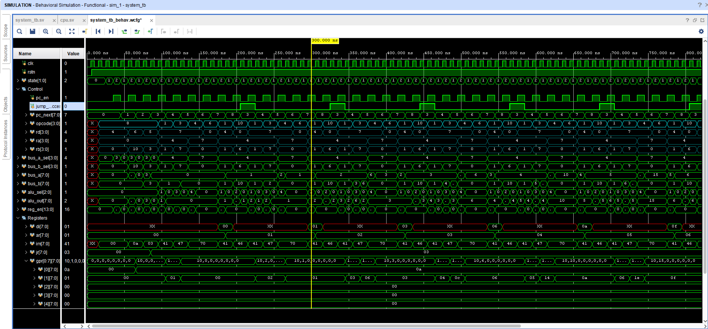

# A Custom RISC CPU in 99 Lines of SystemVerilog

A-RISC is built as a teaching material, to introduce computer architecture & implementation to newbies. Objectives of the design are as follows:

* Full featured: ability to run any algorithm, such as prime finding, basic image processing...etc.
* Simple architecture: harvard, 8-bit data & addresses
* Easy to program: RISC-V like ISA
* Contains all components of a processor for teaching: PC, state machine (fetch, decode, execute), ALU, general purpose registers, bus
* Reduced Instruction Set: Each instruction is 16-bit, does exactly one job in one clock cycle (in cpu v1)
* Easily pipelinable: Each instruction takes only one clock, can be pipelined later
* Easy implementation: Just 99 lines of SystemVerilog code

To achieve the above objectives, design of cpu-v1 trades-off the following:

* SRAMs with 1 clock latency
* Relatively long combinational paths

CPU-v3 will be a slightly modified version of v1, with a 6-stage pipeline, SRAMs with 2 clock latency, and short combinational paths for high frequency implementation.

## Instruction Set Architecture

Basic ISA with 11 instructions. Each instruction is 16-bit, and has 4 bit-fields: [opcode, rd, ra, rb], 4 bits each. Instructions are fetched through a 16-bit bus in a single clock.

```
0 :  END               :  stop execution
1 :  ADD  rd  ra  rb   :  R[rd]     <- R[ra] + R[rb]
2 :  SUB  rd  ra  rb   :  R[rd]     <- R[ra] - R[rb]
3 :  MUL  rd  ra  rb   :  R[rd]     <- R[ra] * R[rb]
4 :  DV2  rd  ra       :  R[rd]     <- R[ra]/2
5 :  LDC  rd  [_con_]  :  R[rd]     <- con = {rb,ra}
6 :  LDM               :  DIN       <- DRAM[ADR]
7 :  STM      ra       :  DRAM[ADR] <- R[ra]
8 :  MOV  rd  ra       :  R[rd]     <- R[ra]
9 :  BNE      ra  rb   :  branch to IRAM[JAD] if R[ra] != R[rb]
10:  BLT      ra  rb   :  branch to IRAM[JAD] if R[ra] <  R[rb] 
```

## Register Addressing (rd, ra, rb)

CPU is parametrized with `NUM_GPR < 11` number of General Purpose Registers.
The following addressing scheme is used to read from `ra`, `rb` source registers & write to `rd` destination registers.

```
* 0    : 0   (constant wire)
* 1    : 1   (constant wire)
* 2    : DIN (dout wire of DRAM)
* 3    : CON (const wire of current instruction, for LDC)
* 4    : ADR (address register for DRAM)
* 5    : JAD (jump address register for IRAM)
* 6... : General Purpose Registers
```

## Sample Assembly

Sample task: Compute & store the first 10 triangular numbers: `n(n+1)/2 for n<10.`

### C++

```cpp
int main() {
	for (char n = 0; n < 10; n++){
		volatile char* address = (volatile char*)n;
		*address = n*(n+1)/2;
	}
}
```

### Assembly

```
Line no.:    Assembly      |      Processor operation     |    Description

   0    : ldc adr, 0       | ADR    <- 0                  | n = adr = 0      
   1    : ldc r0 , 10      | R0     <- 10                 | N = r0  = 10     

   2    : add r1 , adr, 1  | R1     <- ADR + 1            | x = (n+1)        
   3    : mul r1 , adr, r1 | R1     <- ADR * R1           | x = n(n+1)       
   4    : dv2 r1 , r1      | R1     <- R1  /2             | x = n(n+1)/2     
   5    : stm      r1      | M[ADR] <- R1                 | M[n] = n(n+1)/2  
   6    : add adr, adr, 1  | ADR    <- ADR + 1            | n += 1           
   7    : ldc jad, 2       | JAD    <- 2                  | load jump-to address (2)
   8    : blt      adr, r0 | branch to JAD if (ADR < R0)  | repeat (2-8) until n=10

   9    : end              | stop                         | stop             
```
See `txt/input/triangular.txt` for corresponding machine code.

### Execution waveform



## Architecture

