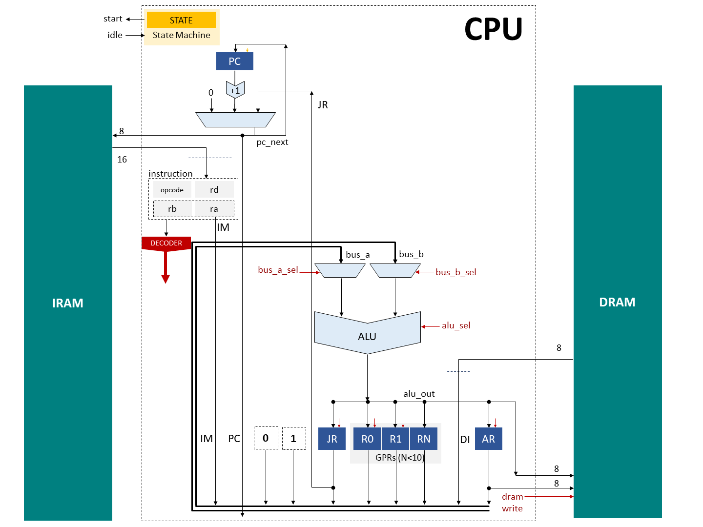
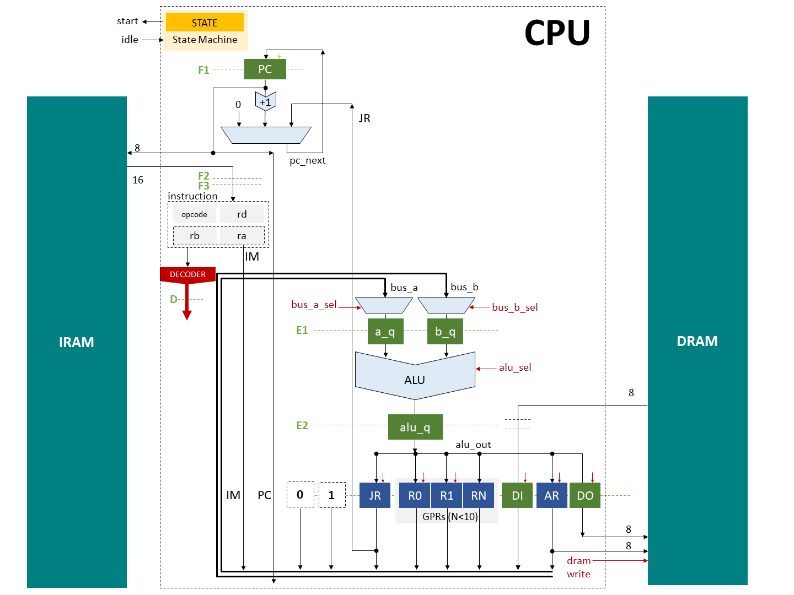
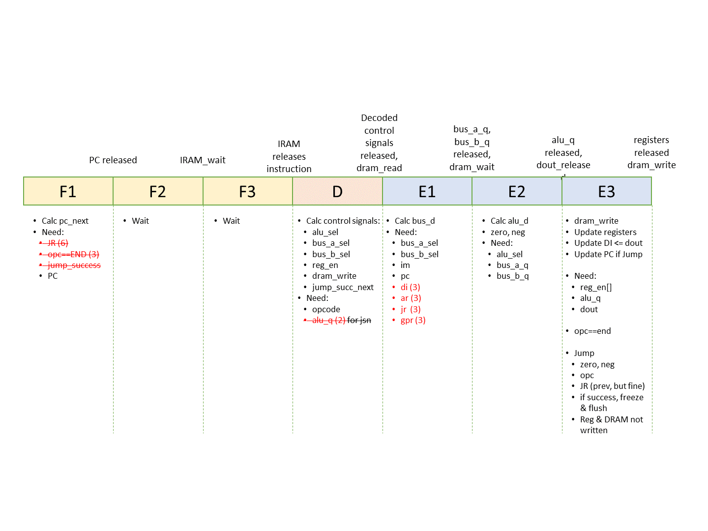

# A Custom RISC CPU in 99 Lines of SystemVerilog

A-RISC is built as a teaching material, to introduce computer architecture & implementation to newbies. Objectives of the design are as follows:

* Full featured: ability to run complex algorithms, such as prime finding, basic image processing...etc.
* Simple architecture: harvard, W-bit (parametrized) data & addresses
* Easy to program: RISC-V-like ISA
* Contains all components of a processor for teaching: PC, state machine (fetch, decode, execute), ALU, general purpose registers, bus
* Reduced Instruction Set: Load-store ISA, each instruction is 16-bit, does exactly one job
* Easily pipelineable: Each instruction takes 1 cycle in v1, can be easily pipelined to multiple stages (v2).
* Easy implementation: Just 99 lines of SystemVerilog code (v1)

To achieve the above objectives, design of v1 trades-off the following:

* SRAMs with 1 clock latency
* Relatively long combinational paths

CPU-v2 will be a slightly modified version of v1, with a 7-stage pipeline, SRAMs with 2 clock latency, and short combinational paths for high frequency implementation.

## Instruction Set Architecture

Simple load-store ISA with 11 instructions. Each instruction is 16-bit, and has 4 bit-fields: [opcode, rd, ra, rb], 4 bits each. Instructions are fetched through a 16-bit bus in a single clock (v1).

```
0 :  END               :  stop execution
1 :  ADD  rd  ra  rb   :  R[rd]     <- R[ra] + R[rb]
2 :  SUB  rd  ra  rb   :  R[rd]     <- R[ra] - R[rb]
3 :  MUL  rd  ra  rb   :  R[rd]     <- R[ra] * R[rb]
4 :  DV2  rd  ra       :  R[rd]     <- R[ra]/2
5 :  LDM               :  DI        <- DRAM[AR]
6 :  STM      ra       :  DRAM[AR]  <- R[ra]
7 :  MVR  rd  ra       :  R[rd]     <- R[ra]
8 :  MVI  rd  [ im ]   :  R[rd]     <- im = {rb,ra}
9 :  BEQ      ra  rb   :  branch to IRAM[JR] if R[ra] == R[rb]
10:  BLT      ra  rb   :  branch to IRAM[JR] if R[ra] <  R[rb] 
```

## Register Addressing (rd, ra, rb)

CPU is parametrized with `NUM_GPR < 10` number of General Purpose Registers.
The following addressing scheme is used to read from `ra`, `rb` source registers & write to `rd` destination registers.

```
* 0    : 0   (constant wire)
* 1    : 1   (constant wire)
* 2    : DI  (dout wire of DRAM)
* 3    : IM  (immediate: 8-bit wire {rb,ra} of current instruction, for MVI)
* 4    : AR  (address register for DRAM)
* 5    : JR  (jump address register for IRAM)
* 6    : PC  (pc_next = current iram_addr; to save return address in function calls)
* 7... : General Purpose Registers
```

## Sample Assembly

To compute & store the first 10 triangular numbers: `n(n+1)/2 for n < 10`.

### C++

```cpp
int main() {
	for (char n = 0; n < 10; n++){
		volatile char* address = (volatile char*)n;
		*address = n*(n+1)/2;
	}
}
```

### Assembly

```
LINE NO.: ASSEMBLY               | PROCESSOR OPERATION        | DESCRIPTION

   0    : mvi ar, 0              | AR    <- 0                 | n = ar = 0      
   1    : mvi r0, 10             | R0    <- 10                | N = r0 = 10     
   2    : mvi jr, $for_n         | JR    <- 3=$for_n          | set jump-to address (3)

   3    : $for_n  add r1, ar, 1  | R1    <- AR + 1            | x = (n+1)        
   4    :         mul r1, ar, r1 | R1    <- AR * R1           | x = n*(n+1)       
   5    :         dv2 r1, r1     | R1    <- R1  /2            | x = n*(n+1)/2     
   6    :         stm     r1     | M[AR] <- R1                | M[n] = n*(n+1)/2  
   7    :         add ar, ar, 1  | AR    <- AR + 1            | n += 1           
   8    :         blt     ar, r0 | branch to JR if (AR < R0)  | repeat (2-8) until n=10

   9    : end                    | stop                       | stop             
```
See `algo/1_triangular_in_both.txt` for corresponding machine code.

### Assembler

A simple python-based assembler also provided. If you have Python 3.7+ installed, the following command would read the assembly from the given file and generate machine code at `algo/1_triangular_in_mcode.txt`, which can be read by the SystemVerilog testbench.

* Case, space insensitive
* Commas are optional
* Empty lines and comments (starting with #) are ignored
* Jump labels are like `$loop1`

Assembling:
```
python py/assembler.py algo/1_triangular_in_assembly.txt
```


### Execution waveform

SystemVerilog testbench at `sv/tb/system_tb.sv` is configured to read text files (edit filename), load them into DRAM and IRAM, run the processor, store DRAM outputs and `$finish`.


## Architecture

Parameters:

* W: Register width. Maximum depth of DRAM & IRAM will be 2**W
* NUM_GPR: Number of General Purpose Registers
### Single Cycle (v1)



### Pipelined with 7 stages (v2)


### Planned Pipeline (v2)



## Lines of Code

To count lines of code:

```
sudo apt install cloc
cloc sv/rtl/cpu.sv sv/rtl/register.sv
```